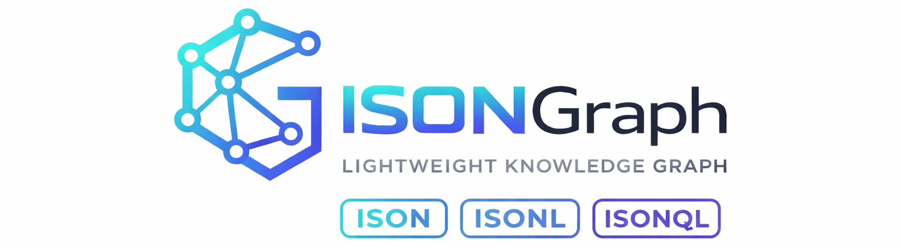

<p align="center">
  
</p>

# ison-graph-cpp

[](https://isocpp.org/)
[](https://en.wikipedia.org/wiki/Header-only)
[](https://opensource.org/licenses/MIT)

**ISONGraph** - A token-efficient property graph store with ISON persistence for C++17.

## Features

- **Header-Only**: Just include and use - no compilation needed
- **Property Graph Model**: Nodes and edges with typed properties
- **O(1) Lookups**: Fast node access by (type, id)
- **Multi-Hop Traversal**: 1-hop, N-hop, and range queries
- **Path Finding**: BFS shortest path
- **ISONQL Query Language**: Declarative graph queries
- **Schema Validation**: Type-safe graph constraints
- **Fluent API**: Chainable traversal queries
- **ISON Persistence**: Token-efficient serialization
- **Zero Dependencies**: Pure C++17 standard library

## Installation

Copy the header files to your project, or use CMake:

```bash
mkdir build && cd build
cmake ..
cmake --build .
```

**Required Headers:**
- `include/ison_graph.hpp` - Core graph library
- `include/isonql.hpp` - ISONQL query language
- `include/isongraphantic.hpp` - Schema validation

## Quick Start

```cpp
#include "ison_graph.hpp"

using namespace ison_graph;

int main() {
    // Create a graph
    ISONGraph graph("social");

    // Add nodes
    graph.addNode("person", "1", {{"name", "Alice"}, {"age", "30"}});
    graph.addNode("person", "2", {{"name", "Bob"}, {"age", "25"}});
    graph.addNode("person", "3", {{"name", "Charlie"}, {"age", "35"}});
    graph.addNode("company", "100", {{"name", "TechCorp"}});

    // Add edges
    graph.addEdge("KNOWS", {"person", "1"}, {"person", "2"}, {{"since", "2020"}});
    graph.addEdge("KNOWS", {"person", "2"}, {"person", "3"}, {{"since", "2021"}});
    graph.addEdge("WORKS_AT", {"person", "1"}, {"company", "100"}, {{"role", "Engineer"}});

    // Query neighbors
    auto friends = graph.neighbors({"person", "1"}, "KNOWS");

    // Multi-hop traversal
    auto fof = graph.multiHop({"person", "1"}, "KNOWS", 2);

    // Shortest path
    auto path = graph.shortestPath({"person", "1"}, {"person", "3"}, "KNOWS");
    if (path) {
        std::cout << "Path length: " << path->length() << std::endl;
    }

    // Serialize
    std::string ison = graph.toIson();

    return 0;
}
```

## API Reference

### ISONGraph

```cpp
ISONGraph graph("name");           // Directed graph
ISONGraph graph("name", false);    // Undirected graph
```

#### Node Operations

| Method | Description |
|--------|-------------|
| `addNode(type, id, props)` | Add a node |
| `getNode(type, id)` | Get a node |
| `hasNode(type, id)` | Check if exists |
| `removeNode(type, id)` | Remove node and edges |
| `updateNode(type, id, props)` | Update properties |
| `nodeCount()` | Count all nodes |
| `nodeCount(type)` | Count nodes of type |
| `nodeTypes()` | Get all types |
| `nodes()` | Iterate over all nodes |
| `nodesOfType(type)` | Iterate over nodes of type |

#### Edge Operations

| Method | Description |
|--------|-------------|
| `addEdge(rel, src, tgt, props)` | Add an edge |
| `getEdge(rel, src, tgt)` | Get an edge |
| `hasEdge(rel, src, tgt)` | Check if exists |
| `removeEdge(rel, src, tgt)` | Remove edge |
| `edgeCount()` | Count all edges |
| `edgeCount(type)` | Count edges of type |
| `edgeTypes()` | Get all types |
| `edges()` | Iterate over all edges |
| `edgesOfType(type)` | Iterate over edges of type |

#### Traversal

| Method | Description |
|--------|-------------|
| `neighbors(ref, rel, dir)` | Get neighbors |
| `multiHop(start, rel, hops, dir)` | N-hop traverse |
| `multiHopRange(start, rel, min, max, dir)` | Range traverse |

#### Path Finding

| Method | Description |
|--------|-------------|
| `shortestPath(start, end, rel, max, dir)` | BFS shortest |
| `pathExists(start, end, rel, max)` | Check reachability |

#### Graph Analysis

| Method | Description |
|--------|-------------|
| `inDegree(ref)` | Count incoming edges |
| `outDegree(ref)` | Count outgoing edges |
| `degree(ref)` | Total degree |
| `isConnected()` | Check connectivity |
| `hasCycle(rel)` | Detect cycles |

#### Serialization

| Method | Description |
|--------|-------------|
| `toIson()` | Serialize to ISON |
| `toIsonl()` | Serialize to ISONL |

### Types

```cpp
struct NodeRef {
    std::string type;
    std::string id;
};

using Properties = std::map<std::string, std::string>;

enum class Direction {
    Out,
    In,
    Both
};
```

### Fluent API

```cpp
auto companies = GraphTraversal(graph, {"person", "1"})
    .hop("KNOWS")
    .hop("WORKS_AT")
    .filter([](const Node& n) { return n.properties.at("industry") == "Tech"; })
    .collect();
```

---

## ISONQL Query Language

ISONQL is a declarative query language for ISONGraph, providing SQL-like queries for property graphs.

### Basic Usage

```cpp
#include "ison_graph.hpp"
#include "isonql.hpp"

using namespace ison_graph;
using namespace ison_graph::isonql;

// Create and populate graph
ISONGraph graph("social");
graph.addNode("person", "alice", {{"name", "Alice"}, {"age", "30"}, {"city", "NYC"}});
graph.addNode("person", "bob", {{"name", "Bob"}, {"age", "25"}, {"city", "LA"}});
graph.addNode("person", "charlie", {{"name", "Charlie"}, {"age", "35"}, {"city", "NYC"}});
graph.addNode("company", "techcorp", {{"name", "TechCorp"}, {"size", "500"}});
graph.addEdge("KNOWS", {"person", "alice"}, {"person", "bob"}, {{"since", "2020"}});
graph.addEdge("KNOWS", {"person", "bob"}, {"person", "charlie"}, {{"since", "2021"}});
graph.addEdge("WORKS_AT", {"person", "alice"}, {"company", "techcorp"}, {{"role", "Engineer"}});

// Create query engine
QueryEngine engine(graph);

// Execute queries
auto result = engine.execute("NODES person WHERE age > 25");
std::cout << "Found " << result.count() << " people" << std::endl;
```

### Supported Query Types

#### NODES - Query Nodes

```cpp
// All nodes of a type
engine.execute("NODES person");

// With WHERE clause
engine.execute("NODES person WHERE age > 25");

// Multiple conditions
engine.execute("NODES person WHERE age > 25 AND city = NYC");

// With sorting
engine.execute("NODES person WHERE age > 20 ORDER BY age DESC");

// With pagination
engine.execute("NODES person ORDER BY name ASC LIMIT 10 OFFSET 5");

// Return specific fields
engine.execute("NODES person WHERE city = NYC RETURN name, age");

// Shorthand syntax
engine.execute("NODES person(city=NYC)");
```

#### EDGES - Query Edges

```cpp
// All edges of a type
engine.execute("EDGES KNOWS");

// With WHERE clause on edge properties
engine.execute("EDGES KNOWS WHERE since > 2020");

// With limit
engine.execute("EDGES WORKS_AT LIMIT 10");
```

#### TRAVERSE - Graph Traversal

```cpp
// Single hop outgoing
engine.execute("TRAVERSE person:alice -> KNOWS -> person");

// Single hop incoming
engine.execute("TRAVERSE person:bob <- KNOWS <- person");

// Multi-hop with max depth
engine.execute("TRAVERSE person:alice -> KNOWS -> person MAX 3");

// Undirected traversal
engine.execute("TRAVERSE person:alice -- KNOWS -- person");

// Any node type
engine.execute("TRAVERSE person:alice -> WORKS_AT -> *");
```

#### PATH - Find Shortest Path

```cpp
// Find shortest path between nodes
engine.execute("PATH person:alice TO person:charlie");

// Via specific relationship
engine.execute("PATH person:alice TO person:charlie VIA KNOWS");

// With max hops
engine.execute("PATH person:alice TO person:charlie VIA KNOWS MAX 5");
```

#### COUNT - Count Nodes

```cpp
// Count all nodes of a type
engine.execute("COUNT person");

// Count with filter
engine.execute("COUNT person WHERE city = NYC");
```

#### Aggregations - SUM, AVG, MIN, MAX

```cpp
// Sum a property
engine.execute("SUM person.age");

// Average with filter
engine.execute("AVG person.age WHERE city = NYC");

// Min value
engine.execute("MIN person.age");

// Max value
engine.execute("MAX company.size");
```

### Query Operators

| Operator | Description | Example |
|----------|-------------|---------|
| `=`, `==` | Equal | `name = Alice` |
| `!=`, `<>` | Not equal | `city != LA` |
| `>` | Greater than | `age > 25` |
| `>=` | Greater or equal | `age >= 25` |
| `<` | Less than | `age < 30` |
| `<=` | Less or equal | `age <= 30` |
| `IN` | In list | `city IN (NYC, LA, SF)` |
| `CONTAINS` | Contains substring | `name CONTAINS ali` |
| `STARTS_WITH` | Starts with | `name STARTS_WITH A` |
| `ENDS_WITH` | Ends with | `name ENDS_WITH e` |
| `MATCHES` | Regex match | `email MATCHES ^[a-z]+@` |
| `EXISTS` | Field exists | `EXISTS email` |
| `NOT EXISTS` | Field missing | `NOT EXISTS phone` |

### Working with Results

```cpp
auto result = engine.execute("NODES person WHERE age > 25");

// Access result metadata
std::cout << "Count: " << result.count() << std::endl;
std::cout << "Total: " << result.totalCount() << std::endl;
std::cout << "Time: " << result.executionTimeMs() << "ms" << std::endl;

// Access nodes
for (const auto& node : result.nodes()) {
    std::cout << "Node: " << node.type << ":" << node.id << std::endl;
    for (const auto& [k, v] : node.properties) {
        std::cout << "  " << k << ": " << v << std::endl;
    }
}

// Access edges
for (const auto& edge : result.edges()) {
    std::cout << "Edge: " << edge.source.type << ":" << edge.source.id;
    std::cout << " -> " << edge.target.type << ":" << edge.target.id << std::endl;
}

// Access paths
for (const auto& path : result.paths()) {
    std::cout << "Path of " << path.length << " hops" << std::endl;
    for (const auto& node : path.nodes) {
        std::cout << "  -> " << node.type << ":" << node.id << std::endl;
    }
}

// Access aggregation value
if (result.hasValue()) {
    std::cout << "Value: " << result.getValue() << std::endl;
}
```

### Fluent Query Builder

For programmatic query construction, use the fluent builder API:

```cpp
#include "isonql.hpp"

using namespace ison_graph::isonql;

QueryEngine engine(graph);

// Build and execute node query fluently
auto result = engine.match("person")
    .where("age", ">", "25")
    .where("city", "=", "NYC")
    .orderBy("age", SortOrder::DESC)
    .limit(10)
    .execute();

// Count query
size_t count = engine.match("person")
    .where("city", "=", "NYC")
    .count();

std::cout << "Found " << count << " people in NYC" << std::endl;

// With field selection
auto result = engine.match("person")
    .where("age", ">=", "21")
    .select({"name", "age"})
    .offset(5)
    .limit(10)
    .execute();

// Edge queries
auto edges = engine.matchEdges("KNOWS")
    .where("since", ">", "2020")
    .limit(10)
    .execute();
```

---

## Schema Validation (ISONGraphantic)

The schema module provides type-safe graph validation with property constraints, relationship rules, and graph-level constraints.

### Basic Usage

```cpp
#include "ison_graph.hpp"
#include "isongraphantic.hpp"

using namespace ison_graph;
using namespace ison_graph::schema;

// Define node types
auto person = NodeTypeBuilder("person")
    .id(IntField())
    .field("name", StringField().required().maxLength(100))
    .field("age", IntField().min(0).max(150))
    .field("email", StringField().email())
    .build();

auto company = NodeTypeBuilder("company")
    .id(IntField())
    .field("name", StringField().required())
    .build();

// Define edge types
auto knows = EdgeTypeBuilder("KNOWS")
    .fromNode("person")
    .toNode("person")
    .noSelfLoop()
    .unique()
    .build();

auto worksAt = EdgeTypeBuilder("WORKS_AT")
    .fromNode("person")
    .toNode("company")
    .cardinality(Cardinality::ManyToOne)
    .build();

// Build schema
auto schema = GraphSchemaBuilder("social")
    .nodeType(person)
    .nodeType(company)
    .edgeType(knows)
    .edgeType(worksAt)
    .noOrphans()
    .build();

// Validate graph
ISONGraph graph("test");
graph.addNode("person", "1", {{"name", "Alice"}, {"age", "30"}});
graph.addNode("person", "2", {{"name", "Bob"}, {"age", "25"}});
graph.addEdge("KNOWS", {"person", "1"}, {"person", "2"}, {});

auto result = schema.validate(graph);
if (result.isValid()) {
    std::cout << "Graph is valid!" << std::endl;
} else {
    for (const auto& error : result.errors()) {
        std::cout << "Error: " << error.message << std::endl;
    }
}
```

### Field Types

#### StringField

```cpp
// Basic string field
StringField()

// Required field
StringField().required()

// Length constraints
StringField().minLength(3).maxLength(100)

// Pattern matching (regex)
StringField().pattern(R"(^[A-Z][a-z]+$)")

// Email validation
StringField().email()

// Allowed values (enum)
StringField().allowed({"active", "inactive", "pending"})
```

#### IntField

```cpp
// Basic integer field
IntField()

// Required
IntField().required()

// Range constraints
IntField().min(0).max(150)

// Or use range()
IntField().range(0, 150)
```

#### FloatField

```cpp
// Basic float field
FloatField()

// With constraints
FloatField().required().min(0.0).max(100.0)

// Using range
FloatField().range(-180.0, 180.0)  // e.g., longitude
```

#### BoolField

```cpp
// Basic boolean field
BoolField()

// Required boolean
BoolField().required()
```

### Node Type Schema

```cpp
auto person = NodeTypeBuilder("person")
    // Validate the ID field
    .id(IntField())

    // Define property fields
    .field("name", StringField().required().maxLength(100))
    .field("age", IntField().min(0).max(150))
    .field("email", StringField().email())
    .field("status", StringField().allowed({"active", "inactive"}))
    .build();
```

### Edge Type Schema

```cpp
// Basic edge type
auto knows = EdgeTypeBuilder("KNOWS")
    .fromNode("person")
    .toNode("person")
    .build();

// With constraints
auto worksAt = EdgeTypeBuilder("WORKS_AT")
    .fromNode("person")
    .toNode("company")
    .noSelfLoop()      // Cannot connect node to itself
    .unique()          // No duplicate edges
    .cardinality(Cardinality::ManyToOne)  // Many persons, one company per person
    .build();

// With edge properties
auto reportsTo = EdgeTypeBuilder("REPORTS_TO")
    .fromNode("person")
    .toNode("person")
    .noSelfLoop()
    .acyclic()         // Must be DAG (no cycles)
    .field("since", IntField().required())
    .field("department", StringField())
    .build();

// Bidirectional edges
auto friendsWith = EdgeTypeBuilder("FRIENDS_WITH")
    .fromNode("person")
    .toNode("person")
    .noSelfLoop()
    .bidirectional()   // If A->B exists, B->A must also exist
    .build();
```

### Edge Constraints

| Constraint | Method | Description |
|------------|--------|-------------|
| No Self Loop | `.noSelfLoop()` | Edge cannot connect node to itself |
| Unique | `.unique()` | No duplicate edges between same pair |
| Acyclic | `.acyclic()` | Must form DAG (no cycles) |
| Bidirectional | `.bidirectional()` | Reverse edge must exist |
| Cardinality | `.cardinality(card)` | Relationship cardinality |

### Cardinality Constraints

```cpp
// One-to-One: Each source has exactly one target, each target has one source
// Example: person HAS_PASSPORT passport
EdgeTypeBuilder("HAS_PASSPORT")
    .cardinality(Cardinality::OneToOne);

// One-to-Many: One source to many targets, each target has one source
// Example: company HAS_DEPARTMENT department
EdgeTypeBuilder("HAS_DEPARTMENT")
    .cardinality(Cardinality::OneToMany);

// Many-to-One: Many sources to one target
// Example: person WORKS_AT company (many employees, one company per person)
EdgeTypeBuilder("WORKS_AT")
    .cardinality(Cardinality::ManyToOne);

// Many-to-Many: No restrictions (default)
// Example: person KNOWS person
EdgeTypeBuilder("KNOWS")
    .cardinality(Cardinality::ManyToMany);
```

### Graph-Level Constraints

```cpp
auto schema = GraphSchemaBuilder("social")
    .nodeType(person)
    .edgeType(knows)

    // Graph must be connected (all nodes reachable)
    .connected()

    // No orphan nodes (all nodes must have at least one edge)
    .noOrphans()

    // Maximum depth constraint
    .maxDepth(10)
    .build();
```

### Validation Results

```cpp
auto result = schema.validate(graph);

// Check validity
if (result.isValid()) {
    std::cout << "Graph is valid" << std::endl;
}

// Access errors
for (const auto& error : result.errors()) {
    std::cout << "[" << error.location << "] " << error.code << ": " << error.message << std::endl;
}

// Access warnings
for (const auto& warning : result.warnings()) {
    std::cout << "Warning: " << warning.message << std::endl;
}
```

### Error Codes

| Code | Description |
|------|-------------|
| `REQUIRED_FIELD` | Required field is missing |
| `INVALID_TYPE` | Value type doesn't match schema |
| `MIN_VALUE` | Value below minimum |
| `MAX_VALUE` | Value above maximum |
| `MIN_LENGTH` | String too short |
| `MAX_LENGTH` | String too long |
| `PATTERN_MISMATCH` | Doesn't match regex pattern |
| `INVALID_EMAIL` | Not a valid email format |
| `INVALID_ENUM` | Value not in allowed list |
| `SELF_LOOP` | Self-loop not allowed |
| `DUPLICATE_EDGE` | Duplicate edge (when unique) |
| `CARDINALITY_VIOLATION` | Cardinality constraint violated |
| `INVALID_SOURCE_TYPE` | Edge source is wrong node type |
| `INVALID_TARGET_TYPE` | Edge target is wrong node type |
| `CYCLE_DETECTED` | Cycle found (when acyclic required) |
| `NOT_CONNECTED` | Graph is not connected |
| `ORPHAN_NODE` | Node has no edges |
| `MAX_DEPTH_EXCEEDED` | Graph depth exceeds limit |

### Complete Example

```cpp
#include "ison_graph.hpp"
#include "isongraphantic.hpp"

using namespace ison_graph;
using namespace ison_graph::schema;

int main() {
    // Define node types
    auto user = NodeTypeBuilder("user")
        .id(IntField())
        .field("username", StringField()
            .required()
            .minLength(3)
            .maxLength(50)
            .pattern(R"(^[a-zA-Z0-9_]+$)"))
        .field("email", StringField().required().email())
        .field("age", IntField().min(13).max(150))
        .build();

    auto post = NodeTypeBuilder("post")
        .id(IntField())
        .field("title", StringField().required().maxLength(200))
        .field("content", StringField().required())
        .field("status", StringField().allowed({"draft", "published", "archived"}))
        .build();

    auto comment = NodeTypeBuilder("comment")
        .id(IntField())
        .field("text", StringField().required().maxLength(1000))
        .build();

    // Define edge types
    auto follows = EdgeTypeBuilder("FOLLOWS")
        .fromNode("user")
        .toNode("user")
        .noSelfLoop()
        .build();

    auto authored = EdgeTypeBuilder("AUTHORED")
        .fromNode("user")
        .toNode("post")
        .cardinality(Cardinality::OneToMany)
        .build();

    auto commentedOn = EdgeTypeBuilder("COMMENTED_ON")
        .fromNode("comment")
        .toNode("post")
        .cardinality(Cardinality::ManyToOne)
        .build();

    auto wroteComment = EdgeTypeBuilder("WROTE_COMMENT")
        .fromNode("user")
        .toNode("comment")
        .cardinality(Cardinality::OneToMany)
        .build();

    // Build schema
    auto schema = GraphSchemaBuilder("blog")
        .nodeType(user)
        .nodeType(post)
        .nodeType(comment)
        .edgeType(follows)
        .edgeType(authored)
        .edgeType(commentedOn)
        .edgeType(wroteComment)
        .build();

    // Create and populate graph
    ISONGraph graph("blog");

    graph.addNode("user", "1", {
        {"username", "alice_dev"},
        {"email", "alice@example.com"},
        {"age", "28"}
    });

    graph.addNode("user", "2", {
        {"username", "bob_coder"},
        {"email", "bob@example.com"},
        {"age", "32"}
    });

    graph.addNode("post", "101", {
        {"title", "Introduction to C++"},
        {"content", "C++ is a powerful programming language..."},
        {"status", "published"}
    });

    graph.addEdge("AUTHORED", {"user", "1"}, {"post", "101"}, {});
    graph.addEdge("FOLLOWS", {"user", "2"}, {"user", "1"}, {});

    // Validate
    auto result = schema.validate(graph);
    if (result.isValid()) {
        std::cout << "Blog graph is valid!" << std::endl;
    } else {
        for (const auto& error : result.errors()) {
            std::cout << "Validation error: " << error.message << std::endl;
        }
    }

    return 0;
}
```

---

## Exception Handling

```cpp
#include "ison_graph.hpp"

using namespace ison_graph;

try {
    graph.addNode("person", "1", {});
    graph.addNode("person", "1", {}); // throws DuplicateNodeError
} catch (const DuplicateNodeError& e) {
    std::cerr << "Duplicate node: " << e.what() << std::endl;
}

try {
    auto node = graph.getNode("person", "999"); // throws NodeNotFoundError
} catch (const NodeNotFoundError& e) {
    std::cerr << "Node not found: " << e.what() << std::endl;
}

try {
    graph.addEdge("KNOWS", {"person", "1"}, {"person", "999"}); // throws NodeNotFoundError
} catch (const NodeNotFoundError& e) {
    std::cerr << "Cannot create edge: " << e.what() << std::endl;
}
```

---

## ISON Format

ISONGraph uses a token-efficient serialization format:

```
nodes.person
id name age
1 Alice 30
2 Bob 25

edges.KNOWS
source target since
:person:1 :person:2 2020
```

### ISONL (Line-Oriented Format)

For streaming/appending:

```
nodes.person|id name|1 Alice
nodes.person|id name age|2 Bob 25
edges.KNOWS|source target since|:person:1 :person:2 2020
```

---

## Requirements

- C++17 compiler (GCC 7+, Clang 5+, MSVC 2017+)
- CMake 3.14+ (optional)
- Standard Library only (no external dependencies)

## Building Tests

```bash
mkdir build && cd build
cmake ..
cmake --build .
ctest --output-on-failure
```

## License

MIT License - see [LICENSE](../LICENSE) for details.

## Author

**Mahesh Vaikri**
- Website: [graph.ison.dev](https://graph.ison.dev)
- Documentation: [graph.ison.dev/docs.html](https://graph.ison.dev/docs.html)
- GitHub: [@maheshvaikri-code](https://github.com/maheshvaikri-code)
